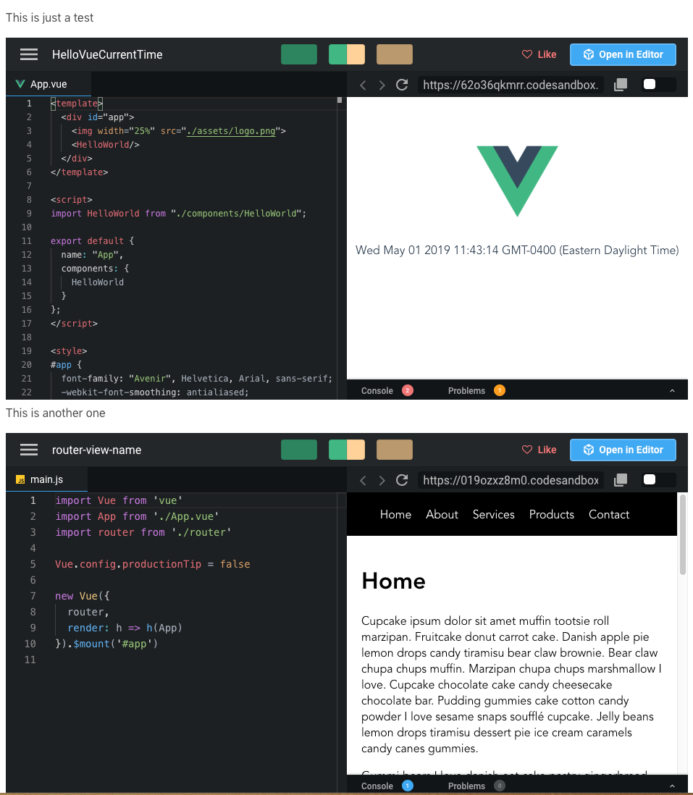

# Gridsome Plugin Remark CodeSandbox


This ia plugin for Gridsome's markdown engine Remark and it allows you to embed a CodeSandbox in your markdown files.

## Installation

```bash
npm install gridsome-plugin-remark-codesandbox
```

## How to use

```
module.exports = {
  plugins: [
    {
      use: '@gridsome/source-filesystem',
      options: {
        path: 'blog/**/*.md',
        route: '/blog/:year/:month/:day/:slug',
        remark: {
          plugins: [
            [ 'gridsome-plugin-remark-codesandbox']
          ]
        }
      }
    }
  ]
}
```

## Usage

When you want to include a CodeSandbox in your markdown file just put the embed link on its own line. 

```

This is just a test

https://codesandbox.io/embed/62o36qkmrr?fontsize=12

This is another one

https://codesandbox.io/embed/019ozxz8m0?fontsize=14
```

This is what the result looks like 



## Embed Options

You can pass options to the embed as a query string parameters. If you want to know what options are available check out the documentation on CodeSandboxes website below.

https://codesandbox.io/docs/embedding#embed-options


